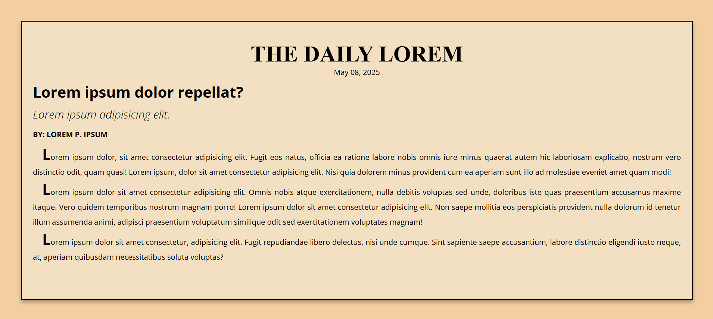

# 💻 Newspaper Article

## ℹ️ A Simple Newspaper Article Landing Page

This project replicates the classic layout and feel of a vintage newspaper article using only HTML and CSS. With careful attention to typography, spacing, and alignment, it mimics the columned, print-style presentation found in traditional publications.

It was built entirely with HTML and CSS as part of the [**freeCodeCamp.org**](https://www.freecodecamp.org/learn/full-stack-developer/) CSS course.

---

## 🔍 Overview

The Newspaper Article project is a layout exercise that practices semantic HTML and advanced text formatting using CSS. It includes a simulated article layout with a title, date, subheading, byline, and several paragraphs of content.

This project emphasizes good use of margin, padding, text indenting, drop caps, shadows, and font choices. It also explores how to center content, apply soft visual effects, and create a clean, readable interface for long-form text.

---

## ✨ Features

- Fully semantic HTML5 structure
- Vintage newspaper theme layout
- Drop cap style using `::first-letter`
- Centered masthead and date using text utilities
- Justified paragraph alignment for traditional readability
- Shadowed container for a soft paper-like box effect
- Custom font pairing via Google Fonts
- Fully responsive and readable on all screen sizes

---

## 🧠 What I Learned

- How to simulate a newspaper layout using only HTML and CSS
- Using `::first-letter` to create drop cap effects
- Controlling text readability with `text-align`, `text-indent`, and `line-height`
- Styling headlines, bylines, and dates with subtle hierarchy
- Applying realistic box shadows to containers for soft elevation
- Managing responsive font sizes and margins for readability

---

## 🛠️ Tech Used

- HTML5
- CSS3
- Git
- GitHub
- Netlify

---

## 🚀 How to Run

1. Clone the repository
2. Open `index.html` in your browser

---

## 🌐 Live Demo

Or you can check out the 👉 [live website here](https://newspaper-article-fcc-jiro.netlify.app/)

---

## 🧑‍💻 Author

Created by **Elmar Chavez**

🗓️ Month/Year: **May 2025**

📚 Journey: **2nd** month of learning _frontend web development_.
